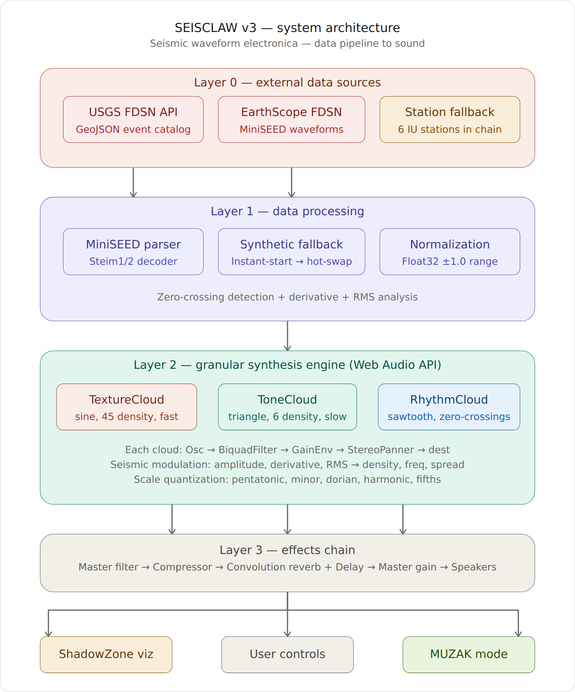
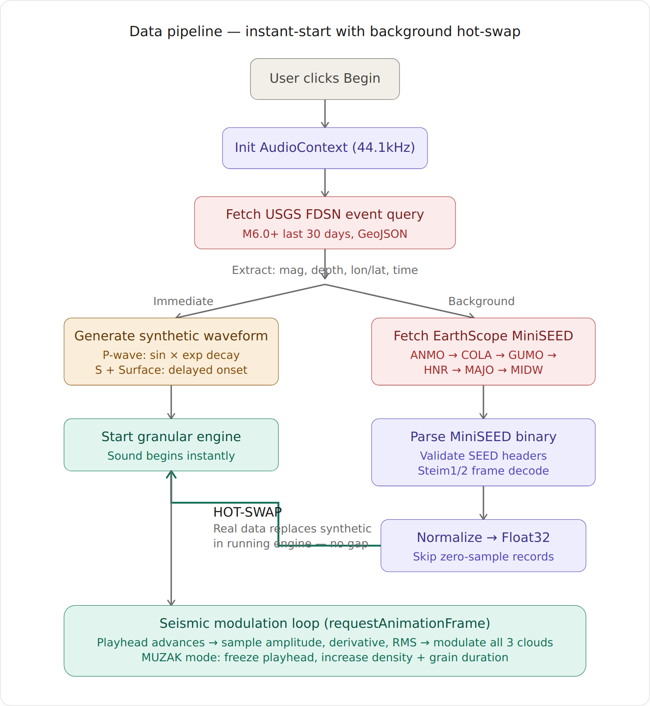
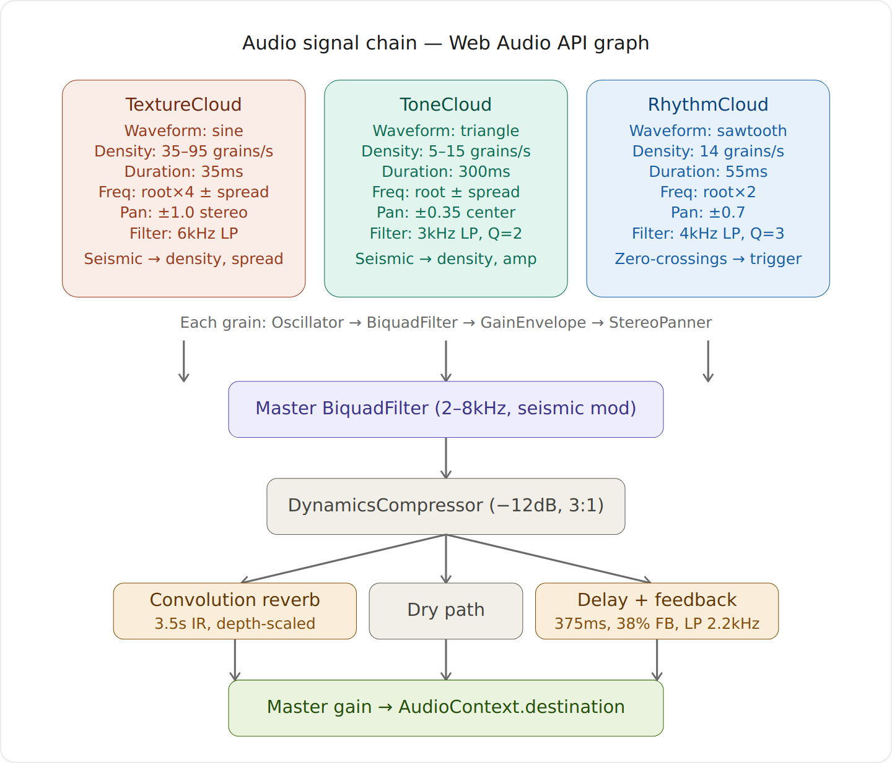

# SEISCLAW  — System Architecture

**Seismic Waveform Electronica**
*Three-layer granular synthesis driven by live earthquake data*

[seisclaw.com](https://seisclaw.com/) · [sos.allshookup.org](https://sos.allshookup.org/) · [github.com/strikeslip/SeisClaw](https://github.com/strikeslip/SeisClaw)

---

## Overview

SEISCLAW is a browser-based seismic sonification engine that transforms real earthquake waveform data into generative electronic music. Built entirely in vanilla Web Audio API with no external libraries, it fetches live seismic data, decodes raw binary MiniSEED format in-browser, and drives a three-layer granular synthesis architecture where every musical parameter — density, frequency, stereo spread, filter cutoff — is continuously modulated by the Earth's seismic voice.

---

## 1. System Architecture



The system is structured in four layers:

**Layer 0 — External data sources**: USGS FDSN Event API returns GeoJSON earthquake catalogs (M6.0+, last 30 days). EarthScope FDSN Dataselect delivers raw binary MiniSEED waveforms (BHZ channel, 60-second window around the event origin). A six-station IU fallback chain (ANMO → COLA → GUMO → HNR → MAJO → MIDW) ensures data availability — if a station returns 204/404 or times out at 15 seconds, the next is tried automatically.

**Layer 1 — Data processing**: The MiniSEED parser handles Steim1 and Steim2 compressed frames plus uncompressed Int16/Int32/Float32 encodings, all in pure JavaScript with no ObsPy dependency. A synthetic waveform generator models P/S/surface wave phases for instant-start playback. Normalization maps decoded samples to Float32 in the ±1.0 range. Zero-crossing detection, first-difference derivative, and windowed RMS analysis feed the modulation system.

**Layer 2 — Granular synthesis engine**: Three independent granular clouds (TextureCloud, ToneCloud, RhythmCloud) generate streams of micro-sound grains whose parameters are continuously modulated by the seismic data. All grain frequencies are quantized to the selected musical scale (pentatonic, minor, dorian, harmonic, or fifths).

**Layer 3 — Effects chain**: Master BiquadFilter (seismic-modulated 2–8kHz sweep) → DynamicsCompressor (−12dB threshold, 3:1 ratio) → parallel Convolution Reverb (3.5s algorithmic IR, depth-scaled) + Delay (375ms, 38% filtered feedback) + dry path → Master Gain → speakers. The ShadowZone canvas visualization, user controls, and MUZAK mode operate alongside.

---

## 2. Data Pipeline



The v3 instant-start architecture eliminates all wait time between pressing Begin and hearing sound:

1. **User clicks Begin** → AudioContext initializes at 44.1kHz
2. **USGS FDSN query** returns the most recent M6.0+ event as GeoJSON — magnitude, depth, coordinates, and origin time are extracted
3. **Immediate path**: A synthetic waveform is generated from earthquake parameters (magnitude scales amplitude, depth scales decay constants, compound P/S/surface wave model) and the granular engine starts playing instantly
4. **Background path**: Real MiniSEED data is fetched from EarthScope, walking the station fallback chain with 15-second timeouts per attempt
5. **MiniSEED parsing**: SEED v2.4 headers are validated, zero-sample records are skipped (EarthScope AWS migration artifact), Steim1/2 frames are decoded, and samples are normalized to Float32
6. **Hot-swap**: When real data arrives, `loadSeismicData()` replaces the synthetic waveform array and recalculates zero-crossings in the running engine — no audible gap, no restart

If all six stations fail, the synthetic waveform continues indefinitely.

---

## 3. Audio Signal Chain



### Grain architecture

Each individual grain follows the signal path: `OscillatorNode → BiquadFilterNode (lowpass) → GainNode (envelope) → StereoPannerNode → destination`

### Three clouds

| Cloud | Waveform | Density | Duration | Frequency | Pan | Seismic modulation |
|-------|----------|---------|----------|-----------|-----|--------------------|
| **TextureCloud** | sine | 35–95/s | 35ms | root×4 ± spread | ±1.0 full stereo | amplitude → density, derivative → spread |
| **ToneCloud** | triangle | 5–15/s | 300ms | root ± spread | ±0.35 center | RMS → density, amplitude |
| **RhythmCloud** | sawtooth | 14/s | 55ms | root×2 | ±0.7 | RMS → trigger probability, amplitude |

### Effects chain

The master BiquadFilter sweeps its cutoff continuously: `targetFilter = 2000 + amplitude × 6000` (clamped 1–10kHz, 25ms time constant). The convolution reverb uses an algorithmically generated 3.5-second stereo impulse response with `(1 - i/length)^2.3` power decay and early reflections. The delay line uses filtered feedback (2.2kHz lowpass) with depth-responsive time and feedback gain. The DynamicsCompressor prevents clipping during high-amplitude seismic events.

### Scale quantization

All grain frequencies are quantized to the nearest pitch in the selected scale, calculated across octaves −3 to +4 from the root frequency (25–8000 Hz range):

- **Pentatonic**: [0, 2, 4, 7, 9] semitones
- **Minor**: [0, 2, 3, 5, 7, 8, 10]
- **Dorian**: [0, 2, 3, 5, 7, 9, 10]
- **Harmonic**: [0, 12, 19, 24, 28, 31, 34, 36] (harmonic series)
- **Fifths**: [0, 7, 14, 21, 28] (stacked perfect fifths)

### MUZAK mode

Freezes the playhead and reconfigures the clouds for ambient sustained output: TextureCloud density → 90, grain duration → 150ms, frequency spread → 0.15; ToneCloud density → 14, grain duration → 500ms. Musical note particles are emitted on the ShadowZone canvas.

---

## Technical Specifications

- **Runtime**: Pure browser — vanilla HTML/CSS/JavaScript, zero dependencies
- **Audio**: Web Audio API (AudioContext at 44.1kHz)
- **Rendering**: Canvas 2D (DPR-aware, max 2×)
- **Data format**: Raw binary MiniSEED with Steim1/2 decompression
- **Browser compatibility**: Safari 14+, Chrome 80+, Firefox 78+, Edge 80+
- **Mobile**: iOS/Android responsive, touch-optimized, safe-area-inset aware

---

## Data Flow Summary

```
[USGS Earthquake API] → GeoJSON event (mag, depth, coordinates, time)
         │
         ├─→ [Synthetic Waveform] → Float32Array → [Granular Engine] → SOUND
         │                                                ↑
         └─→ [EarthScope FDSN] → MiniSEED binary         │
                    │                                      │
                    └─→ [Station Fallback Chain]            │
                              │                            │
                              └─→ [MiniSEED Parser]        │
                                         │                 │
                                         └─→ [Normalize] ──→ HOT-SWAP
```

---

*SEISCLAW — SOS · Sounds Of Seismic*
*Copyright © 2026 SHOOK · MIT License*
*Sweet Love For Planet Earth*
